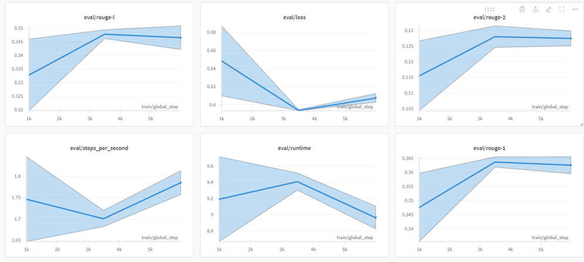

# Title (Please modify the title)
## Team

|  |  |  |  |  |
| :--------------------------------------------------------------: | :--------------------------------------------------------------: | :--------------------------------------------------------------: | :--------------------------------------------------------------: | :--------------------------------------------------------------: |
|            [이승민](https://github.com/UpstageAILab)             |            [한지웅](https://github.com/UpstageAILab)             |            [최패캠](https://github.com/UpstageAILab)             |            [김패캠](https://github.com/UpstageAILab)             |            [오패캠](https://github.com/UpstageAILab)             |
|                            데이터 전처리, 역번역                             |                            데이터 전처리, koEDA, 발표 역할                             |                            담당 역할                             |                            담당 역할                             |                            담당 역할                             |

# Dialogue Summarization - 4조

## 1. 팀 소개

- **이승민**  
  관심 분야: 컴퓨터 비전(CV), 대형 언어 모델(LLM), 프롬프트 엔지니어링  
  역할: 베이스라인 코드 분석, 모델 선택 및 학습  
  목표: AI에 대한 지식을 넓히고 창업 기회를 탐색

- **한지웅**  
  관심 분야: 컴퓨터 비전(CV), 반도체  
  역할: 베이스라인 코드 분석, 데이터 증강  
  목표: AI 전반에 대한 포괄적인 지식을 배우고 창업 아이디어 구상

## 2. 프로젝트 개요

**프로젝트 주제**: Dialogue Summarization
이 프로젝트의 목표는 일상 대화 데이터를 NLP 모델을 사용하여 한 문장으로 요약하는 것입니다. 사용한 데이터셋은 DialogueSum 데이터셋이며, 한국어로 번역하여 활용했습니다.

**프로젝트 기간**: 2024-08-29 ~ 2024-09-10

### 프로젝트 목표:
- 대화 요약 대회에 참가하며 얻은 인사이트를 공유하는 것이 목표입니다.

**진행 방식**:
-  NLP advanced 강의를 수강하고, 매일 줌을 통해 간단한 회의를 진행했습니다. 이후 오후에는 각자 태스크를 분석하고, 베이스라인 코드와 데이터셋을 개선하는 방식으로 진행했습니다.

## 3. 대회 진행과정

**1단계: 베이스라인 코드 및 데이터 분석**
- 우선 베이스라인 코드를 분석하고, 학습 데이터셋을 통일하고 전처리하는 방법을 이해하기 위해 데이터셋을 상세히 분석했습니다.

**2단계: 학습 데이터셋 통일 및 데이터 증강**

모델의 학습 데이터를 향상시키기 위해 여러 데이터 증강 기법을 사용했습니다:

- **AEDA** (Advanced EDA): 이 기법은 유의미한 결과를 도출하지 못해 다른 방법에 집중했습니다.
- **KoEDA** (랜덤 삽입, 랜덤 삭제, 랜덤 교체): KoEDA는 한국어 대화 데이터에 특화된 증강 기법으로 성능 향상에 기여했습니다.
- **역번역** (DeepL 사용): 한국어 데이터를 다른 언어로 번역한 후 다시 한국어로 번역하는 방식으로, 데이터의 다양성과 품질을 크게 개선했습니다.

이러한 방법을 실험한 후, 원본 학습 데이터셋과 KoEDA 데이터셋을 합치고, 이를 역번역을 하여 최종적으로 초기에 비해 4배 증강된 데이터인 최종 `train_final.csv` 파일을 학습에 사용했습니다.

**3단계: 전처리 및 토크나이저 설정**
- `person1~7`, `passportnumber`와 같은 특수 토큰은 분리하지 않고 하나의 단어로 처리했습니다. 이러한 토큰이 한국어로 번역될 때에도 마찬가지로 분리되지 않도록 주의했습니다.
- 불필요한 텍스트 제거와 스탑워드를 제거하는 전처리를 진행하였습니다.

**4단계: 모델 학습 및 추론**
- BART 모델을 학습하고, 손실 값과 ROUGE 점수를 WandB를 통해 모니터링했습니다. 가장 좋은 성능을 기록한 2250번의 학습 스텝 후 모델을 선택했습니다.
             

## 4. 결과 및 인사이트

### 학습 내용:
1. **데이터 관찰**: 데이터를 하나하나 육안으로 확인해보며 문장 데이터의 구조를 이해하고, 필요한 부분과 무시할 부분을 식별함으로써 전처리 방법을 개선했습니다.
2. **모델 조정**: 단순히 전처리만으로는 충분하지 않으며, 모델을 조정하는 것이 더 나은 결과를 위해 중요하다는 것을 배웠습니다.
3. **전처리의 중요성**: 여러 대회를 거듭할 수록, 데이터 전처리가 핵심이라고 느껴집니다. 데이터를 어떻게 증강하고, 전처리하는지에 따라 결과가 가장 크게 변동이 있음을 다시 한 번 느낄 수 있었습니다.
4. **자연어처리는 영어로**: 영어로 데이터셋을 번역하고, summarization 수행 후에 출력값을 다시 한글로 번역하여 수행하면 더욱 효과적이었을거이라 생각이 들어 차후에는 이 방식을 시도하고 싶습니다.

### 데이터 증강 인사이트:
- **AEDA**: 성능에 미치는 영향이 미미했습니다.
- **KoEDA 및 역번역**: 학습 데이터에 변화를 주어 모델 성능을 크게 개선했습니다. 특히 KoEDA는 한국어 대화 데이터에 효과적이었으며, 역번역은 세밀한 번역을 통해 데이터를 풍부하게 만들었습니다. 특히, deepL api 활용을 통해 역번역 증강의 효과를 높일 수 있어 좋았습니다.

## 5. 프로젝트 회고

### 팀원 소감:

- **한지웅**: 자연어 처리 대회를 진행하며, 대화문과 같은 비정형 데이터를 다루는 것이 생각보다 어려웠습니다. 생성형 AI 분야에 관심이 많아서 자연어 처리 관련 내용을 배울 수 있어 좋았습니다.

- **이승민**: 자연어 처리에 원래 관심이 많았고, 이번 프로젝트를 진행하면서 정말 즐거웠습니다. 전보다 더 많은 것을 배웠으며, 특히 전처리에서 더 나은 성과를 얻을 수 있었습니다.

